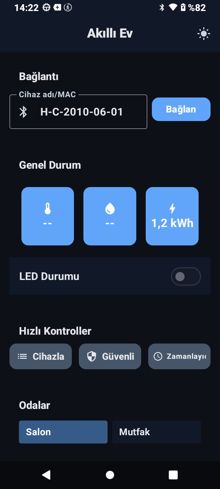
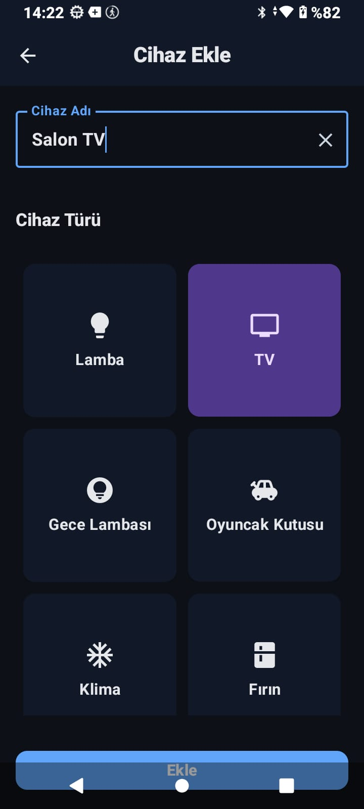
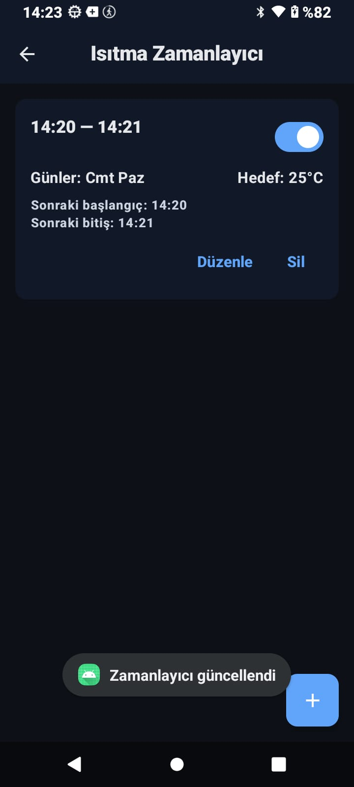

# SmartHome – Akıllı Ev Android Uygulaması
**STM32 + HC-05 (Bluetooth Classic / SPP) · Jetpack Compose · MVVM**

SmartHome, staj projesi kapsamında geliştirilen bir Android uygulamasıdır.  
Uygulama, **STM32** üzerinde çalışan sistemden **DHT11 sıcaklık/nem verisini** kablosuz olarak alır ve **HC-05 Bluetooth Classic (SPP)** üzerinden haberleşerek verileri gerçek zamanlı gösterir. Ayrıca uygulama üzerinden **LED kontrolü** yapılır (akıllı evde klima/cihaz aç-kapa gibi senaryoları simüle etmek için kullanılmıştır).

> Projenin erken aşamasında test amaçlı **Python + Flask + pySerial** ile PC üzerinden köprü denemesi yapılmış, daha sonra doğrudan **telefon ↔ HC-05** bağlantısına geçilmiştir.

---

## 🚀 Özellikler

### 1) Gerçek zamanlı veri izleme
- STM32’den her saniye gelen sıcaklık/nem verileri UI’da güncellenir.
- Veri formatı (STM32 → Android):  
  `XX.X,YY.Y\r\n` (örn. `23.4,58.1\r\n`)

### 2) Cihaz kontrolü (LED / Simülasyon)
- Uygulama üzerinden komut gönderme:
  - `LEDON`
  - `LEDOFF`
- UI tarafında “optimistic update”: hızlı geri bildirim, hata olursa geri alma.

### 3) Manuel / Otomatik mod mantığı (firmware tarafı)
- Manuel komut sonrası sistem **MANUAL** moda geçer.
- Otomatik modda sıcaklık **30°C** eşiğini geçince LED otomatik aktif olabilir.
- STM32 tarafında OLED ekranda sıcaklık/nem + LED durumu + mod bilgisi gösterilebilir.

### 4) Bağlantı dayanıklılığı
- Eşleştirilmiş cihazı **adıyla** bulup bağlanma (`bondedDevices`)
- **RFCOMM** soketi ile SPP bağlantısı
- Kopmalarda **reconnect** desteği
- “socket closed / read failed” durumlarında temiz `disconnect → reconnect` akışı

### 5) Uygulama ekranları
- **Dashboard:** sıcaklık/nem kartları, LED kontrol switch’i, bağlantı ikonu
- **Devices:** eşleştirilmiş cihaz listesi, cihaz seçimi/ekleme akışı
- **Alerts & Schedules:** uyarılar ve zamanlayıcılar  
  - Haftalık gün seçimi + başlangıç/bitiş saatleri  
  - Bir sonraki tetik zamanını gösterme  
  - Android 13+ bildirim izni yönetimi  
  - Arka planda kısa süreli servis ile komut gönderme yaklaşımı

---

## 🧱 Mimari
- **UI:** Jetpack Compose + Navigation  
- **State:** `StateFlow`  
- **Mimari:** MVVM (**Repository → ViewModel → UI**)  
- **Paylaşım:** CompositionLocal ile ViewModel paylaşımı (projede kullanıldı)  
- **Bluetooth:** Classic / SPP (**HC-05 BLE değildir**)  

---

## 📁 Paket/Klasör Yapısı (Genel)
> Projede isimler farklı paketlere dağılmış olabilir; rol dağılımı aşağıdaki gibidir:

- `bt/` : Bluetooth bağlantı ve IO (socket, read/write)
- `repository/` : cihaz bulma, bağlanma, satır bazlı okuma, komut gönderme, reconnect
- `viewmodel/` : UI state (StateFlow), LED toggle vb.
- `ui/` : Dashboard / Devices / Alerts / Schedules ekranları
- `service/` : arka plan komut akışı / kısa süreli servis (varsa)
- `alarm/` : zamanlayıcı altyapısı (varsa)
- `model/` : veri modelleri
- `util/` : yardımcı fonksiyonlar

---

## ✅ Gereksinimler
- Android Studio (güncel stable)
- Bluetooth destekli Android cihaz (**emülatör önerilmez**)
- HC-05 (veya Classic SPP uyumlu modül) + STM32 sistemi
- STM32 seri hız: örn. **9600 baud** (proje ayarına göre)

---

## ⚙️ Kurulum ve Çalıştırma
1. Repo’yu klonla:
   ```bash
   git clone https://github.com/zeyz9y/SmartHome.git
2. Android Studio ile aç ve Gradle Sync bitmesini bekle.
3. Uygulamayı gerçek cihazda çalıştır.
4. Telefon Bluetooth ayarlarından HC-05 ile eşleştir (PIN: 1234 / 0000).
5. Uygulamada Devices ekranından cihazı seç ve bağlan.

🔐 Android 12+ Bluetooth İzinleri (API 31+)

Android 12 ve üzeri sürümlerde Bluetooth izinleri runtime istenir:

BLUETOOTH_CONNECT

BLUETOOTH_SCAN (tarama yapılıyorsa)

İzin yönetimi projede “ihtiyaç olduğunda isteme” yaklaşımıyla ele alınmıştır.

🔔 Android 13+ Bildirim İzni (API 33+)

Alerts/Schedules ekranlarında bildirim kullanılıyorsa:

POST_NOTIFICATIONS runtime izni gerekebilir.

🧪 Test Senaryoları

Eşleştirme: Telefon ↔ HC-05

Bağlantı: Dashboard’tan bağlanma ve durum takibi

Veri akışı: 1 saniyede bir sıcaklık/nem güncellemesi

LED kontrol: switch ile LEDON/LEDOFF

Yeniden bağlanma: kopma sonrası sorunsuz devam

Navigasyon: Devices ekranına geçiş & cihaz seçimi

🛣️ Roadmap

Başlangıçta ESP-01 Wi-Fi ile HTTP/Retrofit planlandı; modül temin edilemediği için nihai çözüm Bluetooth olarak bırakıldı.

İleride Wi-Fi entegre edilirse Bluetooth/TCP geçişi kolay olacak şekilde arayüz ve yapı sadeleştirildi.

🖼️ Ekran Görüntüleri

Küçük görünsün diye HTML ile boyutlandırılmıştır. Tıklayınca dosyayı açabilirsiniz.

<p align="center"> <a href="docs/dashboard.jpeg"></a> <a href="docs/devices.jpeg"></a> <a href="docs/schedules.jpeg"></a> </p>
